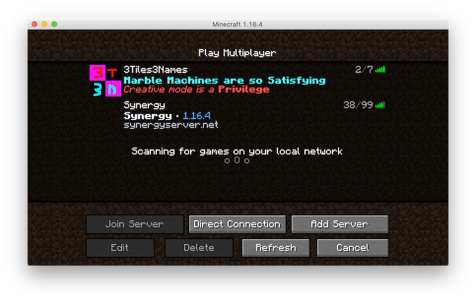

# minecraft-server-motd-3t3n

Minecraft "Ping" plugin for displaying an icon, message of the day (motd) and number of players to those attempting to connect to the server.

(`3t3n` is the abbreviation for a hosted server)



Features:

* Example Minecraft "ping" plugin. Also a very easy initial plugin for those learning about plugin development.
* Compiled to support older servers running on Java 8.
* Tested plugin on these servers:
    * Spigot 1.16.4-R0.1-SNAPSHOT (compile with Java 14 on MacOS) when testing plugin locally.
    * Paper 1.16.4 (compiled with Java 8) running on a paid hosting service using an older version of Java.

## To compile

Setup dependencies for your environment. Refer to [Creating a blank Spigot plugin, using Maven](https://www.spigotmc.org/wiki/creating-a-plugin-with-maven-using-intellij-idea/).

For MacOS, Java 14 was installed and then Maven installed via Home Brew (`brew install maven`).

Prior to compiling, update the version of your plugin if needed in `pom.xml`.

Compile:

    mvn clean package

## To install on your Spigot compatable Minecraft Server

- Copy `target/Motd3T3NPingPlugin-n.n.n.jar` to your server `/plugin` folder, and reload server configuration (or just restart server).

- Copy `src/main/resources/3t3n-icon.png` image to the root of your Minecraft server folder (so plugin can load it).

You should see a message in your server console:

```
[11:50:26] [Server thread/INFO]: [Motd3t3n] Enabling Motd3t3n v1.0.0
```

