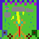

# minecraft-server-motd-3t3n



Minecraft "Ping" plugin for displaying an icon, message of the day (motd) and number of players to those attempting to connect to the server.

(`3t3n` is the abbreviation for a hosted server)


Features:

* Example Minecraft "ping" plugin. Also a very easy initial plugin for those learning about plugin development.
* Compiled to support older servers running on Java 8.
* Tested plugin on these servers:
    * Spigot 1.16.4-R0.1-SNAPSHOT (compile with Java 14 on MacOS) when testing plugin locally.
    * Paper 1.16.4 (compiled with Java 8) running on a paid hosting service using an older version of Java.

## Development Environment Setup and Workflow

If you haven't create a plugin before, you'll need to setup your local development environment and understand the compile and test workflow. I've created a [Minecraft Plugin Development Guide](https://gist.github.com/briangershon/7a009cad2a1e11a7b785e8b8bf6ada1a) to cover this.

## To Release Your Plugin

Make sure you first update the plugin version in `pom.xml` in `<version>1.0.1</version>`.

    mvn clean package

You should now have your new plugin jar file in `target` folder.

## To install on your Spigot compatable Minecraft Server

- Copy `target/Motd3T3NPingPlugin-n.n.n.jar` to your server `/plugin` folder, and reload server configuration (or just restart server).

- Copy `src/main/resources/3t3n-icon.png` image (64x64) to the root of your Minecraft server folder (NOT the `plugin` folder).

You should see a message in your server console:

```
[11:50:26] [Server thread/INFO]: [Motd3t3n] Enabling Motd3t3n v1.0.0
```
